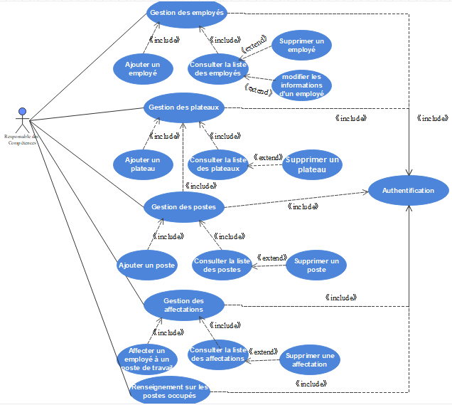
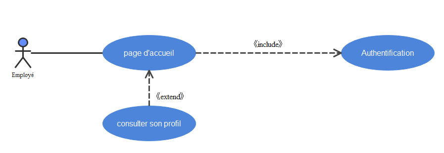
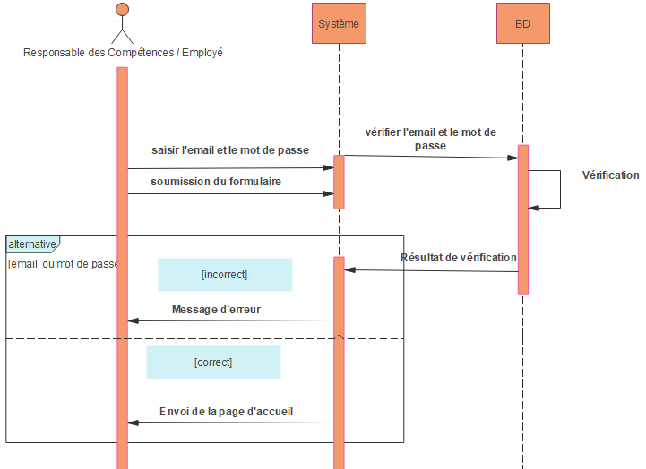
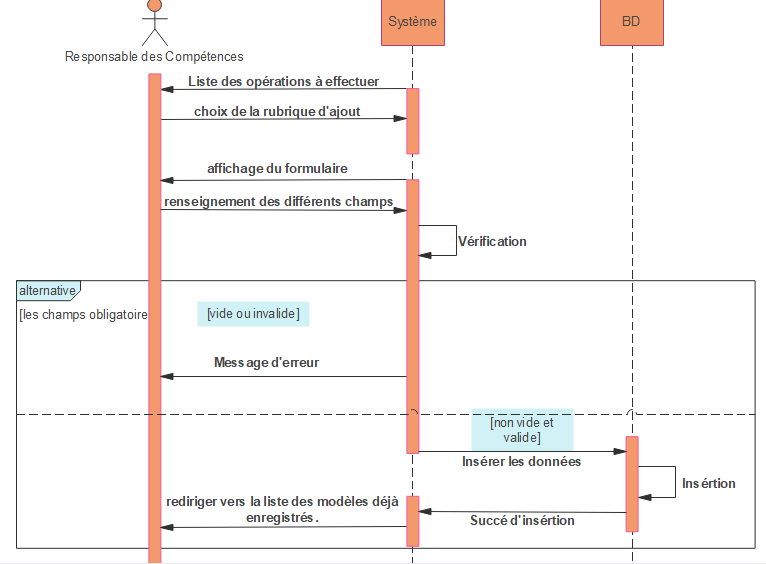
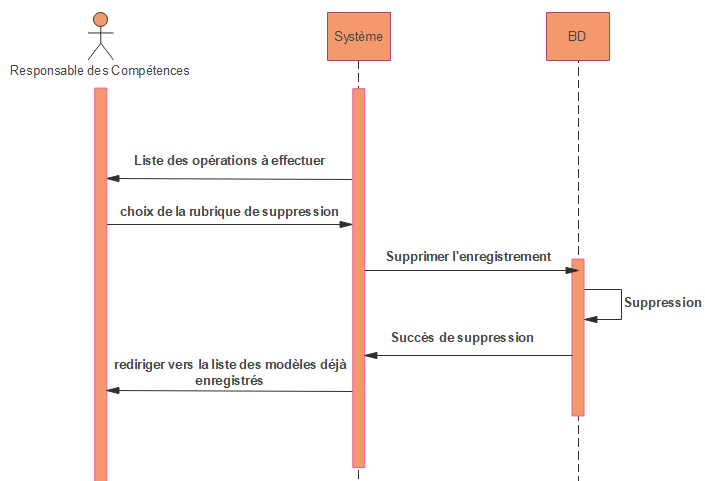
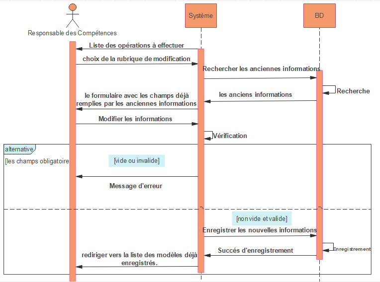
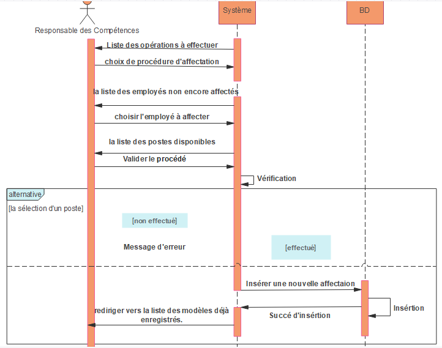
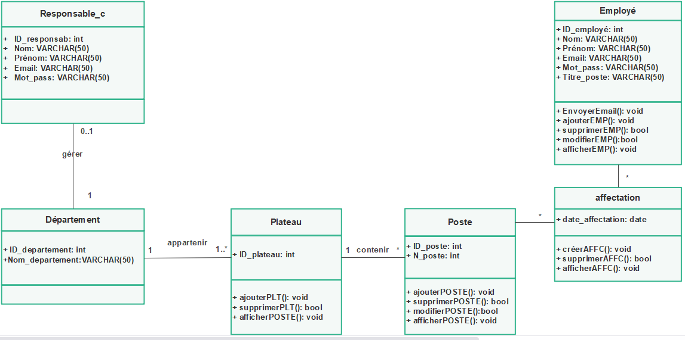

# Titre du projet : 
###### la gestion des postes de travail d'une entreprise 
***
# la conception avec le langage UML:
## 1. Les acteurs de l'application :
On identifie deux acteurs du système :
+	**Le premier acteur** est le responsable des compétences qui a pour rôles de s’authentifier, d’effectuer le CRUD sur les employés les plateaux, et les postes de travail, ainsi d’affecter les employés aux postes de travail, et de traiter l’ensemble des affectations ajout, c'est l'acteur principal du système.
+	**Le deuxième acteur** est l'employé qui a le droit d’avoir un compte crié automatiquement, de s’authentifier, et de consulter son profil.

## 2. Diagrammes de cas d’utilisation :
+ #### Diagramme de cas d’utilisation du    responsable des compétences

+ #### Diagramme de cas d’utilisation d'employé

## 3. Diagrammes de séquences :
+ #### Diagramme de séquence d’authentification :

+ #### Diagramme de séquence pour une opération d’ajout:  

+ #### Diagramme de séquence pour une opération de suppression:

+ #### Diagramme de séquence pour une opération de modification: 

+ #### Diagramme de séquence pour une opération d'affectation: 

## 4. Diagrammes de classe :

***
# les langages utilisés:
## HTML
## CSS 
## bootstrap
## javascript
## symfony
